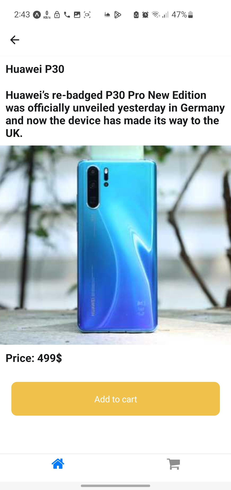

# 🔥 React Native Amazon-Clone App

## ✨ Features :

- Redux (State Management).
- Local Storage (AsyncStorage).
- DummyJson API.
- React Navigation.
- Search Functionality.

## 📹 Video Demo : [React Native Amazon-Clone App](https://drive.google.com/file/d/1TRveDy76gi-hc3mlWloJ797XfCuud8ag/view?usp=sharing)

## 📸 Screenshots :

  

##