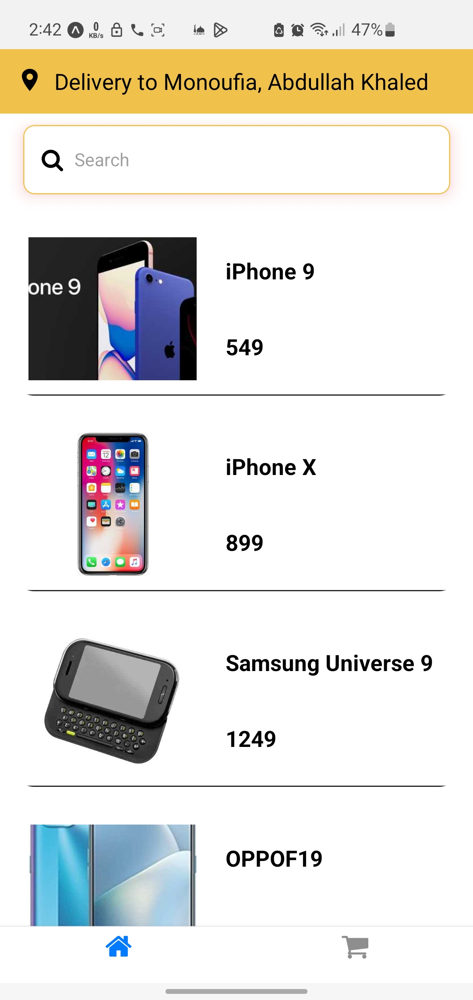
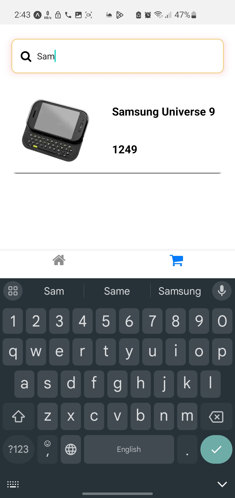

# 🔥 React Native Amazon-Clone App

## ✨ Features :

- 🔥 Features:
- 🔄 Redux for state management.
- 📦 Local Storage (AsyncStorage).
- 🌐 Integration with a DummyJson API.
- 🚀 Smooth navigation with React Navigation.
- 🔍 Search functionality to enhance user experience.

## 📹 Video Demo : [React Native Amazon-Clone App](https://drive.google.com/file/d/1TRveDy76gi-hc3mlWloJ797XfCuud8ag/view?usp=sharing)

## 📸 Screenshots :

  

##
